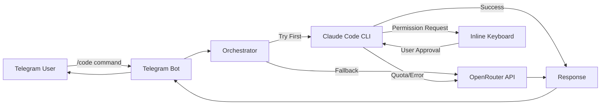

# AgenticGram 🤖

**Universal AI-CLI Bot Framework**

A Telegram bot that bridges remote control to AI CLI tools like Claude Code, designed for lightweight servers like Raspberry Pi.

[](https://opensource.org/licenses/MIT)
[](https://www.python.org/downloads/)

---

## 🌟 Features

- **🔐 Secure Remote Control**: Control AI coding tools via Telegram with user authentication
- **✅ Interactive Permission System**: Approve file edits and command executions via inline buttons
- **🔄 Intelligent Fallback**: Automatic cascade from Claude Code to OpenRouter when needed
- **💾 Session Persistence**: Maintain context across multiple messages
- **📁 File Upload Support**: Send code files directly through Telegram
- **🔍 Permission Audit Trail**: Complete history of all approved/denied actions
- **⚡ Lightweight**: Optimized for Raspberry Pi and low-resource servers
- **🛡️ Error Handling**: Graceful handling of API quotas and connection issues

---

## 📋 Table of Contents

- [Architecture](#architecture)
- [Prerequisites](#prerequisites)
- [Installation](#installation)
- [Configuration](#configuration)
- [Usage](#usage)
- [Model Cascade](#model-cascade)
- [Deployment](#deployment)
- [Security](#security)
- [Troubleshooting](#troubleshooting)
- [Contributing](#contributing)
- [License](#license)

---

## 🏗️ Architecture



### Components

- **Bot Layer** (`bot.py`): Telegram interface with command handlers
- **Orchestrator** (`orchestrator.py`): Routes commands between backends
- **Claude Handler** (`claude_handler.py`): Manages Claude Code CLI with permission parsing
- **OpenRouter Handler** (`openrouter_handler.py`): Fallback API integration
- **Session Manager** (`session_manager.py`): Persistence and workspace management
- **Utils** (`utils.py`): Helper functions and validation

---

## 📦 Prerequisites

### Required

- **Python 3.9+**
- **Node.js 18+** and npm
- **Telegram Bot Token** (from [@BotFather](https://t.me/botfather))
- **Your Telegram User ID** (get from [@userinfobot](https://t.me/userinfobot))

### Optional

- **OpenRouter API Key** (for fallback support) - Get from [openrouter.ai](https://openrouter.ai/)

### System Requirements

- **RAM**: 512MB minimum (1GB recommended)
- **Storage**: 500MB free space
- **OS**: Linux (Debian/Ubuntu/Raspbian), macOS, or WSL on Windows

---

## 🚀 Installation

### Quick Install (Linux/Raspberry Pi)

```bash
# Clone or navigate to the project directory
cd AgenticGram

# Run installation script
chmod +x scripts/install.sh
./scripts/install.sh
```

The script will:
1. ✅ Check system requirements
2. ✅ Install Node.js (if needed)
3. ✅ Install Claude Code CLI
4. ✅ Create Python virtual environment
5. ✅ Install Python dependencies
6. ✅ Create necessary directories
7. ✅ Set up configuration template
8. ✅ Optionally install systemd service

### Manual Installation

```bash
# 1. Install Node.js and npm (if not installed)
curl -fsSL https://deb.nodesource.com/setup_20.x | sudo -E bash -
sudo apt-get install -y nodejs

# 2. Install Claude Code CLI
sudo npm install -g @anthropic-ai/claude-code

# 3. Create Python virtual environment
python3 -m venv venv
source venv/bin/activate  # On Windows: venv\Scripts\activate

# 4. Install Python dependencies
pip install -r requirements.txt

# 5. Create directories
mkdir -p workspace logs

# 6. Copy configuration template
cp config/.env.example .env
```

---

## ⚙️ Configuration

### 1. Create Telegram Bot

1. Open Telegram and search for [@BotFather](https://t.me/botfather)
2. Send `/newbot` and follow the prompts
3. Save the **Bot Token** provided

### 2. Get Your Telegram ID

1. Open [@userinfobot](https://t.me/userinfobot)
2. Send any message
3. Save your **User ID** (numeric)

### 3. Configure Environment

Edit `.env` file:

```env
# Required
TELEGRAM_BOT_TOKEN=1234567890:ABCdefGHIjklMNOpqrsTUVwxyz  # From BotFather
ALLOWED_TELEGRAM_IDS=123456789,987654321  # Your Telegram ID(s)

# Optional - For fallback support
OPENROUTER_API_KEY=sk-or-v1-...  # From openrouter.ai

# Optional - Customize paths
WORK_DIR=./workspace  # Where files are stored
LOG_LEVEL=INFO  # DEBUG, INFO, WARNING, ERROR
PERMISSION_TIMEOUT_MINUTES=5  # Time to approve permissions
```

### Configuration Options

| Variable | Required | Default | Description |
|----------|----------|---------|-------------|
| `TELEGRAM_BOT_TOKEN` | ✅ Yes | - | Bot token from BotFather |
| `ALLOWED_TELEGRAM_IDS` | ✅ Yes | - | Comma-separated user IDs |
| `OPENROUTER_API_KEY` | ❌ No | - | OpenRouter API key |
| `WORK_DIR` | ❌ No | `./workspace` | Working directory path |
| `MAX_SESSION_AGE_HOURS` | ❌ No | `24` | Session expiration time |
| `AUTO_CLEANUP_SESSIONS` | ❌ No | `true` | Auto-delete old sessions |
| `PERMISSION_TIMEOUT_MINUTES` | ❌ No | `5` | Permission approval timeout |
| `LOG_LEVEL` | ❌ No | `INFO` | Logging verbosity |
| `LOG_FILE` | ❌ No | - | Optional log file path |

---

## 💻 Usage

### Starting the Bot

```bash
# Activate virtual environment
source venv/bin/activate

# Run the bot
python -m src.bot
```

### Bot Commands

#### `/start`
Initialize the bot and see welcome message.

```
/start
```

#### `/code <instruction>`
Execute an AI coding instruction.

```
/code Create a Python function to calculate fibonacci numbers
/code Explain this code and suggest improvements
/code Write a SQL query to find top 10 customers
```

#### `/session`
Manage your session.

```
/session new      # Create new session
/session clear    # Clear current session
/session info     # Show session details
```

#### `/status`
Check backend availability.

```
/status
```

#### `/help`
Show help message with all commands.

```
/help
```

### File Uploads

Send code files directly to the bot:

1. Click the attachment icon in Telegram
2. Select a file (`.py`, `.sql`, `.js`, `.txt`, `.json`, `.md`)
3. Send the file
4. Bot will save it to your workspace

### Interactive Permission System

When Claude Code needs to perform an action, you'll receive a message like:

```
🔐 Permission Required

Action: Edit file
File: example.py
Description: Add new function calculate_sum()

[✅ Approve] [❌ Deny]
```

Click the button to approve or deny. You have 5 minutes (configurable) to respond.

---

## 🔄 Model Cascade

AgenticGram uses an intelligent fallback system:

```
1. Try Claude Code CLI
   ├─ Success → Return result
   ├─ Quota exceeded → Fallback to OpenRouter
   └─ Other error → Return error

2. Fallback to OpenRouter
   ├─ Try: anthropic/claude-3.5-sonnet
   ├─ Try: qwen/qwen-2.5-coder-32b-instruct
   ├─ Try: deepseek/deepseek-coder
   └─ Try: meta-llama/llama-3.1-70b-instruct
```

### Why This Approach?

- **Cost Optimization**: Use Claude Code's free tier first
- **Reliability**: Automatic fallback ensures uptime
- **Flexibility**: Easy to add more models
- **Transparency**: User knows which backend was used

---

## 🚢 Deployment

### Running as Systemd Service (Linux)

The installation script can set this up automatically, or manually:

```bash
# Copy service file
sudo cp scripts/ai-bot.service /etc/systemd/system/agenticgram.service

# Edit paths in service file if needed
sudo nano /etc/systemd/system/agenticgram.service

# Reload systemd
sudo systemctl daemon-reload

# Start service
sudo systemctl start agenticgram

# Enable on boot
sudo systemctl enable agenticgram

# Check status
sudo systemctl status agenticgram

# View logs
sudo journalctl -u agenticgram -f
```

### Raspberry Pi Deployment

1. **Install Raspbian OS** (Lite or Desktop)

2. **Update system**:
   ```bash
   sudo apt update && sudo apt upgrade -y
   ```

3. **Clone/copy project** to `/home/pi/AgenticGram`

4. **Run installation script**:
   ```bash
   cd /home/pi/AgenticGram
   chmod +x scripts/install.sh
   ./scripts/install.sh
   ```

5. **Configure** `.env` file

6. **Install as service** (when prompted by install script)

7. **Monitor**:
   ```bash
   # Check status
   sudo systemctl status agenticgram
   
   # View logs
   sudo journalctl -u agenticgram -f
   
   # Restart if needed
   sudo systemctl restart agenticgram
   ```

### Resource Usage

Typical resource usage on Raspberry Pi 4:
- **RAM**: ~150-200MB
- **CPU**: 5-15% during idle, 30-50% during execution
- **Storage**: ~300MB (excluding workspace)

---

## 🔒 Security

### Best Practices

1. **Restrict Access**:
   - Only add trusted Telegram IDs to `ALLOWED_TELEGRAM_IDS`
   - Never share your bot token

2. **Environment Variables**:
   - Never commit `.env` to version control
   - Use strong, unique API keys

3. **Permission System**:
   - Always review permission requests carefully
   - Deny suspicious file edits or command executions

4. **Network Security**:
   - Run on a private network when possible
   - Use firewall rules to restrict access

5. **Updates**:
   - Keep dependencies updated
   - Monitor for security advisories

### Permission Audit

All permission requests are logged to `.sessions.db`:

```python
# View permission history programmatically
from src.session_manager import SessionManager

sm = SessionManager()
history = sm.get_permission_history("session_id")
for req in history:
    print(f"{req.action_type}: {req.approved}")
```

---

## 🐛 Troubleshooting

### Bot doesn't respond

**Check:**
- Bot token is correct in `.env`
- Bot is running: `sudo systemctl status agenticgram`
- Your Telegram ID is in `ALLOWED_TELEGRAM_IDS`

**Solution:**
```bash
# Check logs
sudo journalctl -u agenticgram -f

# Restart bot
sudo systemctl restart agenticgram
```

### Claude Code not found

**Error:** `Claude Code CLI not found in PATH`

**Solution:**
```bash
# Install Claude Code
sudo npm install -g @anthropic-ai/claude-code

# Verify installation
claude-code --version
```

### Permission requests timeout

**Issue:** Permission requests expire before you can respond

**Solution:**
Increase timeout in `.env`:
```env
PERMISSION_TIMEOUT_MINUTES=10  # Increase from 5 to 10
```

### OpenRouter fallback not working

**Check:**
- `OPENROUTER_API_KEY` is set in `.env`
- API key is valid
- Account has credits

**Test:**
```bash
# Check status
/status
```

### File uploads fail

**Check:**
- Workspace directory exists and is writable
- File type is supported (`.py`, `.sql`, `.js`, `.txt`, `.json`, `.md`)
- File size is reasonable (<20MB)

---

## 🤝 Contributing

Contributions are welcome! Please follow these guidelines:

1. Fork the repository
2. Create a feature branch (`git checkout -b feature/amazing-feature`)
3. Follow PEP 8 style guidelines
4. Add comments in English
5. Test your changes
6. Commit with clear messages
7. Push to your branch
8. Open a Pull Request

### Development Setup

```bash
# Install dev dependencies
pip install -r requirements-dev.txt  # If available

# Run tests
pytest  # If tests are available

# Check code style
flake8 src/
black src/ --check
```

---

## 📄 License

This project is licensed under the MIT License - see the [LICENSE](LICENSE) file for details.

---

## 🙏 Acknowledgments

- [python-telegram-bot](https://github.com/python-telegram-bot/python-telegram-bot) - Telegram Bot API wrapper
- [Anthropic](https://www.anthropic.com/) - Claude AI
- [OpenRouter](https://openrouter.ai/) - Multi-model API gateway

---

## 📞 Support

- **Issues**: [GitHub Issues](https://github.com/yourusername/AgenticGram/issues)
- **Discussions**: [GitHub Discussions](https://github.com/yourusername/AgenticGram/discussions)

---

**Made with ❤️ for the open source community**
